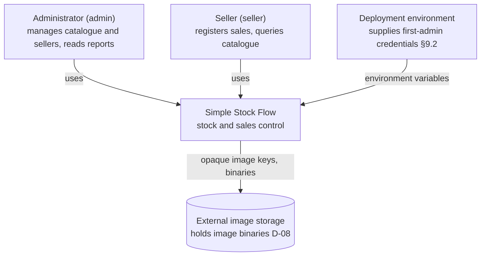
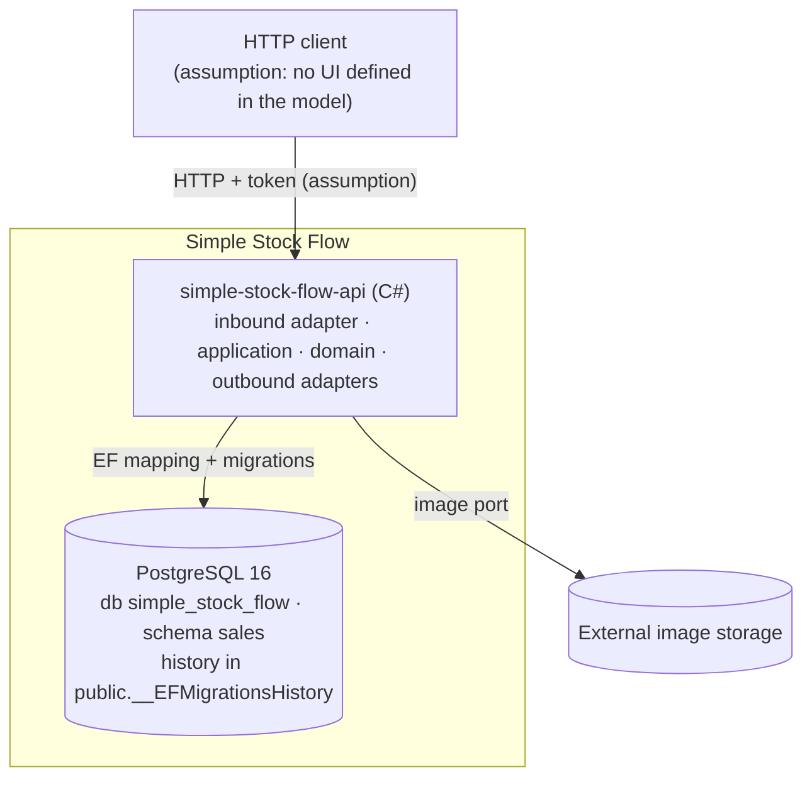

# System Architecture Overview — Simple Stock Flow

> **What this is:** the technical snapshot of the system, rebuilt **backwards from the data model**
> ([`../spec/data-model.md`](../spec/data-model.md), dated 2026-09-19, with its debt register of 2026-09-20 in §13).
> It follows the section layout of the governance template (`05-architecture/overview.md`).
>
> **How to cite:** `§2.3` = a section of the data model · `FK-2` = a foreign-key policy entry (§5) ·
> `Q9` = an access pattern (§6.1) · `D-06` = a technical decision the model mentions ·
> `ADR-00x` = a structural decision the model mentions · `DP-0x` = a product decision the model mentions ·
> `T-xx` = a task the model mentions.
>
> **Rule marks** (the model's own three marks): **engine** (exists in PostgreSQL now) ·
> **domain only** (guaranteed by C# alone) · **pending (T-xx)** (does not exist yet).
>
> **Anything that does not come from the model is marked _Assumption_.** The documents the model links to
> (`plan.md`, `adr/`, `constitution.md`, `api-contract.md`, …) are not delivered; only what the model says
> about them is used. Where the model is silent, this document says "not defined" instead of inventing.
>
> This document is verified against `01-context` … `04-requirements` and the data model in
> [`consistency-check.md`](consistency-check.md).

---

## 1. Adopted architectural style

**Style:** hexagonal architecture (ports and adapters), as **a single service with a single database**.

**Justification (what the model shows):**

| Evidence in the model | What it implies |
|---|---|
| "The domain **never sees the plain-text password**… by design of the hexagon" (§2.5) | A hexagon exists: domain at the centre, no outward dependencies |
| "The hash is produced by a **port**" (§2.5, D-09) | External capabilities enter through ports |
| "Translating between the two is the responsibility of the **persistence adapter**" (§0) | Persistence is an adapter, not part of the domain |
| `deleted_at` and `xmin` are **shadow properties** with no property on the aggregate (D-03, §3, T-10) | The domain is persistence-ignorant; the adapter owns storage details |
| "No **port** creates, renames or deletes categories" (§2.1); "no **port** for editing or deleting" a sale (§2.3) | Ports define which operations exist; what has no port cannot be done |
| "Computed in the engine through a **read port**" (D-06, §1) | A separate read side exists for the report |
| Paths `src/domain/` and `src/adapters/outbound/persistence/Configurations/` (§12) | Real folder structure of `simple-stock-flow-api` |

**Why not microservices:** the model describes **one** database (`simple_stock_flow`), **one** schema (`sales`),
one persistence adapter and one API. It mentions no message broker, no events, no gateway and no second service
(§10, §12). **_Assumption_:** one deployable API unit. The model does not state the style in words, so the style is
**inferred**; the ADR that would record it is not delivered (see §8, AT-009).

**Technology the model confirms:** C# (§0; §2.4 "`internal` constructor"), EF — Entity Framework (§3.1, ADR-001),
PostgreSQL 16.14 in Docker (header, §10).
**_Assumption_:** the inbound adapter is an HTTP API. The model names "the API" (§9.2), `api-contract.md` (§12) and
`SaleView.SoldBy` (§3), and shows 401/403 responses driven by a token (§13, D-3), but gives neither its framework
nor its routes.

**Reference ADRs (named by the model, not delivered):**

| ADR | Decision | Cited in |
|---|---|---|
| ADR-001 | Schema is owned by EF migrations, nothing else | §3.2, §6.2 |
| ADR-002 | Optimistic concurrency; `stock >= 0` as last barrier | header, §2.2 |
| ADR-003 | Soft delete of products | §2.2, §5 |
| ADR-004 | Aggregated, frozen report | §2.4, §11.1 |

---

## 2. C4 Diagram — System level (context)

- **People:** only internal operators with role `admin` or `seller` (§1 *Rol*). **There is no customer or buyer** (§1 *Usuario*, §7).
- **External systems:** image storage (D-08, §7.1). **_Assumption_ (S-A):** the roles are the only actors; the model lists no other system (no payments, no analytics, no export — §7, §7.1).
- **What is not drawn on purpose:** a front end. The model defines no UI. Any client is an _Assumption_.

---

## 3. C4 Diagram — Container level

`simple-stock-flow-infra` holds the Docker setup that starts the database (`simple-stock-flow-db-1`, §10); it defines
no schema (ADR-001, §6.2).

### Inside the API container

| Layer | Contents | Source |
|---|---|---|
| **Inbound adapter** | HTTP endpoints, authentication and authorisation | _Assumption_ (§9.2 says authorisation "lives in the API") |
| **Application** | Use cases; `DateRange` value object ("application layer", §1); startup that creates the first admin (§9.2) | §1, §9.2 |
| **Domain** (`src/domain/`) | Aggregates, value objects, ports | §12 |
| **Outbound adapters** | Persistence (`src/adapters/outbound/persistence/`): EF mappings in `Configurations/`; password-hash; image storage | §12, D-08, D-09 |

> **Dependency rule (template):** dependencies point inward; the domain imports nothing from application or
> infrastructure. The model supports it (§0, §2.5, D-03) but does not state the checklist. **_Assumption_:** driven ports
> are declared in the domain, as the template prescribes.
> **Layout note:** the template shows `infrastructure/adapters/out`; the model's real path is
> `src/adapters/outbound/persistence/` (§12). **The model wins**; both express the same idea.

### Aggregates (consistency boundaries)

| Aggregate | Root | Internal | Table(s) | Cite |
|---|---|---|---|---|
| Catalogue | `Product` | — (`Money` lives in the row, D-07) | `product` | §2.2 |
| Sales | `Sale` | `SaleItem` (`internal` constructor; only `Sale.AddItem` creates it) | `sale`, `sale_item` | §2.3, §2.4 |
| Identity | `User` | — | `user` | §2.5 |
| Reference (**not an aggregate**) | `Category` | — | `category` | §2.1 |

- Aggregates reference each other **by root identity**, never by object (§5, cardinalities). `Sale` → `SaleItem` is **composition** (FK-2).
- **Value objects without a table:** `Money`, `Quantity` (D-07, §2). **Never persisted:** the sales report (§1, D-06).

### Communication patterns

- **Sync:** client → API (_Assumption_: HTTP); API → database through EF; API → image storage through the image port.
- **Async:** **not defined.** No broker, queue, event or outbox appears in the model.
- **Gateway:** none. Single service.

---

## 4. Service catalogue

| # | Service | Responsibility | Port | DB | Communication |
|---|---|---|---|---|---|
| 1 | `simple-stock-flow-api` | Catalogue, sales, report, users and authentication | Not defined | PostgreSQL 16 · `simple_stock_flow` · schema `sales` | HTTP in (_Assumption_), SQL out, image storage out |

One row, on purpose: the model has one service. There is no `09-microservices/service-catalog.md` to point to.

### Ports (driven and read)

The capability comes from the model (access patterns Q1–Q10, §6.1, and explicit mentions of ports). **Port names are an _Assumption_.**

| Port | Capability | Backing in the model |
|---|---|---|
| Product repository | Search (partial text, category, active only, ordered by name, paged) · by id · by batch of ids · save with concurrency control | Q1, Q2, Q3; D-04; ADR-003 |
| Category repository (**read-only**) | List by name · by id | Q4, Q5; §2.1 |
| Sale repository | Save a sale with its lines · sale with lines · sales by range, paged, newest first | Q6, Q7; §2.3 |
| Report read port | Aggregate by product over a range, amount descending, bypassing the domain | Q9; D-06; ADR-004 |
| User repository | By exact username (every login) · save | Q10; §2.5 |
| Password-hash port | Produce and verify the hash; the only legitimate read of `password_hash` | D-09; §7; §9.2 |
| Image-storage port | Store, resolve an address, delete binaries by **opaque key** | D-08; §1; §7.1 |
| Clock and id generator | `sold_at` and UUIDs are set by the application, not the engine | §3; §5 · _Assumption_ that they are ports |

**Q8 (sales by range, unpaged) has no consumer** if the report aggregates in the engine; it "should be removed from the port" (§6.1) and is dropped from this design.

### Where each rule lives

The model's central criterion: **separate what protects the application from what protects the data** (header). A rule kept only in C# is bypassed by any `psql` session, migration or future service.

| Layer | Enforces | Examples (cite) |
|---|---|---|
| **Engine** | Whatever `CHECK`, `UNIQUE`, `FK` and `NOT NULL` express | `stock >= 0` (`ck_product_stock_non_negative`, §2.2/§4); unique `category.name` and `user.username` (§4); `FK-1`, `FK-2`, `FK-3` (§5) |
| **Domain** | **Process** rules a `CHECK` cannot express | Withdrawing more stock than exists fails (`Product.Withdraw`); a sale needs ≥1 line (`Sale.EnsureConfirmable`, which would need "a deferred trigger"); deducting stock and adding the line are one operation (`Sale.AddItem`) (§2.2, §2.3) |
| **Domain, planned move to the engine** | Rules the engine could express | `price > 0`, `quantity > 0`, non-empty `category.name`, `role ∈ {admin, seller}`, lower-case `username` (§4, T-20) |
| **By absence of operation** | Immutability of a sale | No port to edit or delete (§2.3) |
| **API** | Who may do what | "It is authorisation policy and lives in the API" (§9.2); only `admin` creates users; `admin` is provisioned by the deployment (§11 H-3, DP-04) |

> **State of T-20 is not confirmed.** §2.3, §2.4, §4 and §13 (D-2) say `sale_id NOT NULL`, the unique index and `FK-3` are already in the engine, while §2.2 and §4 still describe the **five `CHECK`s** as pending, and §10 is dated 2026-09-19, before that progress. **_Assumption_:** the five `CHECK`s still do not exist; the engine settles it (§10 shows how to measure).

---

## 5. Architectural principles

These principles are **extracted from the model**; before an important decision, check consistency with them.

### P1 — The engine wins
If the document and PostgreSQL disagree, the document is broken (header, §10; article X of the constitution as quoted).

### P2 — Every rule is marked and located
Each rule says whether it lives in the engine, only in the domain, or is pending. **What is not enforced is declared pending; it is never promised** (header, §4, §13).

### P3 — Values are set by the domain, never by the engine
No `DEFAULT`s and no triggers: a default would be "a second source of truth nobody tests" (§3, §8).

### P4 — The schema changes only through migrations
All DDL belongs to EF migrations, including extensions such as `pg_trgm` (ADR-001, §3.2, §6.2).

### P5 — Sales are immutable, frozen facts; derived values are computed, not stored
Name, unit price and category name are copied into the line at the moment of sale; totals and subtotals have no column (§1, §2.4; article VII). A closed report must never change (§11.1).

### P6 — Nothing business-relevant is physically deleted
Products use soft delete (ADR-003); sales are never deleted. `FK-3 RESTRICT` makes a manual `DELETE` fail loudly (§5, §7.1). The only physical deletion is the image binary (§7.1).

### P7 — No surplus
No report table, audit table or counter table; no unrequested attribute (§2, §8, DP-03).

### P8 — Minimal privacy surface
No customer data; the report is **not** broken down by seller (DP-02); `password_hash` never leaves the hash port (§7).

> **Template principles not adopted, and why:** *API-first* — the contract lives in `api-contract.md`, not delivered, so it cannot be claimed here. *Database per service* — there is one service. *Observability by design* — the model says nothing about it (see §7).

---

## 6. Adopted architectural patterns

| Pattern | Adopted | Reference |
|---|---|---|
| Hexagonal (ports and adapters) | Yes | §1 above |
| Aggregates / value objects (DDD) | Yes | §2; D-07 |
| Repository | Yes | §4 ports |
| Optimistic concurrency (`xmin`) | Yes | D-04; ADR-002; §3 |
| Soft delete | Yes | ADR-003; D-03 |
| Frozen snapshot in the sale line | Yes | §1; §2.4; ADR-004 |
| Separate read port for the report | Yes (a read side only, **not** full CQRS) | D-06; Q9 |
| Covering index (`INCLUDE`) for the report | Planned | §6.2 (T-13) |
| Seed through migration | Yes (categories); the admin is created at startup | §9.1; §9.2 |
| API Gateway | No — single service | — |
| Database per service | Not applicable — single database | — |
| Event Sourcing / CQRS / Saga / Outbox / Circuit Breaker | No — nothing in the model calls for them | — |
| Domain events | Not defined by the model | `02-domain` (_Assumption_ there) |

---

## 7. Cross-cutting concerns

| Concern | Adopted solution | Source / where configured |
|---|---|---|
| Authentication | Token-based (_Assumption_: the model shows only its effect — 401 without a token) | §13 D-3 |
| Authorisation | Roles `admin` / `seller`; 403 for `seller` on administration; **nobody grants `admin` at runtime** | §1; §9.2; §11 H-3 (DP-04) |
| First administrator | Created by startup from **environment credentials**; hash by the hash port; no credential versioned | §9.2; D-09, D-10 |
| Secrets and personal data | `password_hash` never in logs, responses, projections or errors; never indexed. `username`, `sold_by` = personal data; `role` = internal-confidential | §7 |
| Concurrency | Optimistic with `xmin`; `ck_product_stock_non_negative` as last barrier | D-04; ADR-002 |
| Transactions | _Assumption_: one transaction per sale, because `Sale.AddItem` changes `Sale` **and** `Product` (§2.3); policy on an `xmin` conflict is not defined | §2.3 |
| Image consistency | No atomicity with the database. Order: null `image_key` → commit → delete the binary. An orphan binary is harmless; a dangling key is not | §7.1 |
| Money | Single currency; `Money` rounds to 2 decimals, `AwayFromZero`; `numeric(18,2)`; both change in the same migration | D-05; §2.2 |
| Time | All timestamps `timestamptz`; server in UTC | §3 |
| Naming | Tables singular; columns `snake_case`; `CHECK` named `ck_{table}_{rule}`; EF-generated names keep EF style | §0; §3.1 |
| Logging, tracing, health checks, error format, rate limiting, CORS | **Not defined in the model.** The error format lives in `api-contract.md` (not delivered) | §12 |

---

## 8. Registered architectural technical debt

IDs are local to this document. "Target" is the task or decision the **model** names; the model gives no sprint or priority.

| ID | Description | Impact | Target | Source |
|---|---|---|---|---|
| AT-001 | Five invariants live **only in C#**: `price > 0`, `quantity > 0`, non-empty `category.name`, `role` in the closed set, lower-case `username`. A manual `INSERT` bypasses them | High: data integrity | T-20 | §2.2, §4 |
| AT-002 | `sale.sold_by` is plain text with no FK. Needs `sold_by_user_id` (FK-4, `RESTRICT`) and the rename to `sold_by_username` | High: authorship can be orphaned | T-12 | §3, §5 FK-4 |
| AT-003 | Missing indexes: `product (category_id, name)` partial, `product (name)` with trigrams (partial), and the covering unique `sale_item (sale_id, product_id)`; plus dropping the redundant `IX_sale_item_sale_id`. The trigram index is the "first to fall" if the extension is objected | Medium: performance of Q1 and Q9 | T-13 | §6.2 |
| AT-004 | `Sale.AddItem` has no explicit currency guard; today it cannot fail because the mapping always rebuilds the default currency | Low | T-05 | §2.3 |
| AT-005 | `NOT NULL` migrations that are "free today and expensive tomorrow": the tables hold 0 sales (§10.4). With the first real sale each remaining one (`sold_by_user_id`; `category_name` if T-11 is still open) needs a backfill | Medium, time-boxed | T-12, T-11 | §10.4, §3 |
| AT-006 | Known defect **A-7**: the product-name selection uses the tie-break that H-1 rejected (DP-01). Measured; **reported, not fixed**, by the owner's instruction | Medium | Owner decision | §11.1 |
| AT-007 | Orphan image binaries have **no clean-up process** | Low | Owner (H-2) | §11 H-2 |
| AT-008 | Port method Q8 has no consumer and is a trap if kept | Low | Remove from the port | §6.1 |
| AT-009 | The ADR recording the architectural style does not exist (the style is inferred, §1) | Low: documentation | Create an ADR | This document |
| AT-010 | `category.name` uniqueness is sensitive to case and accents (*Fontanería* ≠ *Fontaneria*). **Accepted in writing**, with a revision trigger: opening category maintenance | Accepted | Revisit before any category CRUD | §4.1 |

---

## 9. Planned evolution

The model gives **no versions or dates**; the column "When" records the trigger it names.

| Planned change | Motivation | When |
|---|---|---|
| Move the five rules to `CHECK`s | Protect data, not only the application | T-20 |
| Add `sold_by_user_id` + FK-4; rename `sold_by` | Authorship integrity | T-12 |
| Create the missing indexes and install `pg_trgm` in the same migration | Q1 and Q9 performance | T-13 |
| Currency guard in `Sale.AddItem` | Cheap debt | T-05 |
| Rewrite `spec.md` CA-06.1 to "one row per product **and frozen label**" | Today two signed statements contradict each other | Owner's decision (§11.1) |
| Revisit `category.name` uniqueness | Only if category maintenance opens | Trigger, §4.1 |
| A change log (not `created_at`/`updated_at`) | Only if a real audit question appears: "who changed this price, and when?" | Trigger, §8 |

**Decided and not reopened:** single currency (D-05), no seller breakdown (DP-02), product attributes (DP-03), nobody grants `admin` at runtime (DP-04) (§12).

---

## Key correlations

- Data model (source of every claim here) → [`../spec/data-model.md`](../spec/data-model.md)
- Domain entities, rules and events → [`../02-domain/entities-and-rules.md`](../02-domain/entities-and-rules.md), [`../02-domain/domain-events.md`](../02-domain/domain-events.md)
- Requirements and NFRs → [`../04-requirements/user-stories.md`](../04-requirements/user-stories.md), [`../04-requirements/non-functional.md`](../04-requirements/non-functional.md)
- Product vision and problem → [`../03-product/vision.md`](../03-product/vision.md), [`../03-product/problem-framing.md`](../03-product/problem-framing.md)
- Context and scope → [`../01-context/overview.md`](../01-context/overview.md), [`../01-context/scope.md`](../01-context/scope.md)
- Closing check against all of the above → [`consistency-check.md`](consistency-check.md)